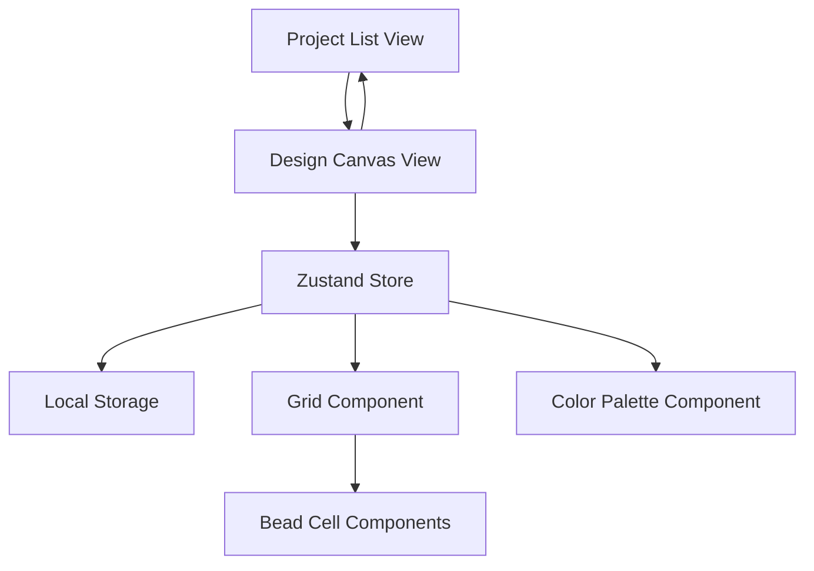

# Design Document

## Overview

The Ironing Beads Designer is a React-based web application that provides an intuitive pixel art creation tool for designing Perler bead patterns. The application uses Next.js with TypeScript, Zustand for state management, and Tailwind CSS with DaisyUI for styling. The design follows a two-view architecture: a project management view for organizing multiple designs and a design canvas view for creating and editing bead patterns.

## Architecture

### High-Level Architecture



### Component Hierarchy

```
IroningBeadsPage
├── ProjectListView
│   ├── ProjectCard[]
│   └── CreateProjectButton
└── DesignCanvasView
    ├── DesignHeader
    │   ├── ProjectTitle
    │   ├── BackButton
    │   └── SaveButton
    ├── DesignWorkspace
    │   ├── ColorPalette
    │   │   ├── ColorSwatch[]
    │   │   └── EraserTool
    │   └── BeadGrid
    │       └── BeadCell[]
    └── DesignActions
        ├── ClearButton
        └── ExportButton
```

## Components and Interfaces

### Core Types

```typescript
interface BeadProject {
  id: string;
  name: string;
  createdAt: Date;
  modifiedAt: Date;
  gridSize: { width: number; height: number };
  beadData: BeadCell[][];
}

interface BeadCell {
  color: string | null;
  isEmpty: boolean;
}

interface ColorPalette {
  id: string;
  name: string;
  hex: string;
  isDefault: boolean;
}

interface DesignTool {
  type: 'color' | 'eraser';
  color?: string;
}
```

### Zustand Store Interface

```typescript
interface IroningBeadsStore {
  // Project Management
  projects: BeadProject[];
  currentProject: BeadProject | null;
  
  // Design State
  selectedTool: DesignTool;
  colorPalette: ColorPalette[];
  gridSize: { width: number; height: number };
  isDragging: boolean;
  
  // Actions
  createProject: (name: string) => void;
  loadProject: (id: string) => void;
  saveProject: () => void;
  deleteProject: (id: string) => void;
  duplicateProject: (id: string) => void;
  
  // Design Actions
  setBeadColor: (x: number, y: number, color: string | null) => void;
  clearBead: (x: number, y: number) => void;
  clearGrid: () => void;
  setSelectedTool: (tool: DesignTool) => void;
  
  // Drag Operations
  startDrag: () => void;
  endDrag: () => void;
  dragOverCell: (x: number, y: number) => void;
}
```

### Component Specifications

#### BeadGrid Component
- Renders a responsive CSS Grid with 29x29 cells by default
- Each cell represents a bead position
- Supports mouse and touch interactions for drawing
- Implements drag-to-draw functionality
- Provides visual feedback for hover states

#### BeadCell Component
- Displays individual bead positions
- Renders as a donut shape when filled using CSS
- Shows color preview on hover
- Handles click and drag events
- Provides accessibility support with ARIA labels

#### ColorPalette Component
- Displays standard Perler bead colors in a sidebar
- Includes eraser tool option
- Shows active tool selection
- Supports keyboard navigation
- Responsive design for mobile devices

## Data Models

### Local Storage Schema

```typescript
interface StorageSchema {
  'ironing-beads-projects': BeadProject[];
  'ironing-beads-settings': {
    defaultGridSize: { width: number; height: number };
    lastProjectId: string | null;
  };
}
```

### Standard Bead Colors

The application will include a predefined palette of standard Perler bead colors:

```typescript
const STANDARD_BEAD_COLORS: ColorPalette[] = [
  { id: 'white', name: 'White', hex: '#FFFFFF', isDefault: true },
  { id: 'black', name: 'Black', hex: '#000000', isDefault: true },
  { id: 'red', name: 'Red', hex: '#FF0000', isDefault: true },
  { id: 'blue', name: 'Blue', hex: '#0000FF', isDefault: true },
  { id: 'green', name: 'Green', hex: '#00FF00', isDefault: true },
  { id: 'yellow', name: 'Yellow', hex: '#FFFF00', isDefault: true },
  // Additional standard colors...
];
```

## Error Handling

### Local Storage Error Handling
- Graceful degradation when localStorage is unavailable
- Automatic retry mechanisms for storage operations
- User notifications for storage failures
- Fallback to session-only mode when persistent storage fails

### User Input Validation
- Project name validation (length, special characters)
- Grid coordinate boundary checking
- Color value validation
- File size limits for future export features

### Error Recovery
- Auto-save functionality to prevent data loss
- Confirmation dialogs for destructive actions
- Undo/redo capability for design changes
- Backup creation before major operations

## Testing Strategy

### Unit Testing
- Zustand store actions and state updates
- Individual component rendering and interactions
- Utility functions for color conversion and validation
- Local storage operations and error handling

### Integration Testing
- Complete user workflows (create → design → save)
- Cross-component communication
- State persistence across page reloads
- Responsive design across different screen sizes

### User Experience Testing
- Touch interaction on mobile devices
- Keyboard navigation accessibility
- Performance with large grid sizes
- Browser compatibility testing

## Performance Considerations

### Rendering Optimization
- React.memo for BeadCell components to prevent unnecessary re-renders
- Virtual scrolling for very large grids (future enhancement)
- Debounced auto-save to reduce storage operations
- Lazy loading of project thumbnails

### Memory Management
- Efficient grid data structure using sparse arrays for empty cells
- Cleanup of event listeners on component unmount
- Optimized color palette rendering
- Minimal re-renders during drag operations

### Mobile Optimization
- Touch-friendly cell sizes (minimum 44px touch targets)
- Responsive grid scaling
- Optimized gesture handling for drawing
- Reduced animation complexity on lower-end devices

## Accessibility Features

### Keyboard Navigation
- Tab navigation through all interactive elements
- Arrow key navigation within the grid
- Keyboard shortcuts for common actions (save, clear, etc.)
- Focus indicators for all interactive elements

### Screen Reader Support
- ARIA labels for grid cells and their states
- Live regions for announcing changes
- Semantic HTML structure
- Alternative text for visual elements

### Visual Accessibility
- High contrast mode support
- Scalable interface elements
- Color-blind friendly palette options
- Customizable grid line visibility

## Future Extensibility

### Grid Size Flexibility
- Dynamic grid size configuration
- Support for rectangular grids
- Custom grid templates (circles, hexagons)
- Multiple grid sizes within single project

### Advanced Features
- Pattern import/export functionality
- Collaborative editing capabilities
- Pattern sharing and community features
- Advanced drawing tools (fill, line, shape tools)

### Integration Possibilities
- Export to various formats (PNG, SVG, PDF)
- Integration with bead supplier APIs
- Cost calculation features
- 3D preview capabilities