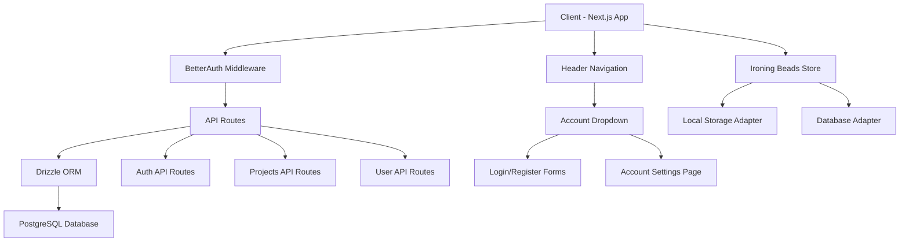
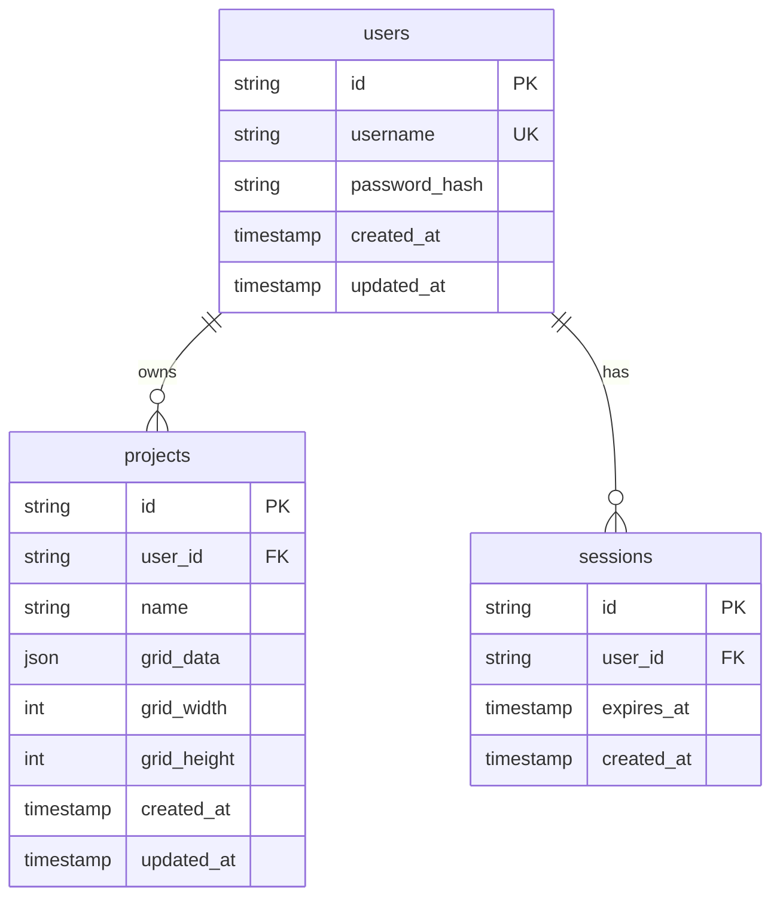

# Design Document

## Overview

The User Authentication system extends the existing Ironing Beads Designer with user account management, database persistence, and secure authentication. The system integrates BetterAuth for authentication, Drizzle ORM with PostgreSQL for data persistence, and adds new UI components for account management. The design maintains backward compatibility with existing local storage functionality while providing a seamless upgrade path for users.

## Architecture

### High-Level Architecture



### Database Schema



## Components and Interfaces

### Extended Type Definitions

```typescript
// Extend existing types
interface User {
  id: string;
  username: string;
  createdAt: Date;
  updatedAt: Date;
}

interface AuthState {
  user: User | null;
  isLoading: boolean;
  isAuthenticated: boolean;
}

// Update BeadProject to include user association and public sharing
interface BeadProject {
  id: string;
  userId: string; // Required - all projects belong to a user
  name: string;
  isPublic: boolean; // Whether the project is publicly discoverable
  createdAt: Date;
  modifiedAt: Date;
  gridSize: { width: number; height: number };
  beadData: BeadCell[][];
  creator?: User; // Populated when viewing public projects
}

// Public project discovery types
interface PublicProject extends BeadProject {
  creator: User;
  viewCount?: number;
  duplicateCount?: number;
}

interface ProjectSearchFilters {
  query?: string;
  sortBy: 'newest' | 'oldest' | 'popular';
  gridSize?: { width: number; height: number };
}
```

### New Components

#### AccountDropdown Component
```typescript
interface AccountDropdownProps {
  user: User | null;
  isLoading: boolean;
  onLogin: () => void;
  onRegister: () => void;
  onLogout: () => void;
  onAccountSettings: () => void;
}
```

#### AuthModal Component
```typescript
interface AuthModalProps {
  mode: 'login' | 'register';
  isOpen: boolean;
  onClose: () => void;
  onSuccess: (user: User) => void;
}
```

#### AccountSettingsPage Component
```typescript
interface AccountSettingsPageProps {
  user: User;
  onPasswordChange: (oldPassword: string, newPassword: string) => Promise<void>;
  onAccountDelete: () => Promise<void>;
}
```

#### PublicProjectGallery Component
```typescript
interface PublicProjectGalleryProps {
  projects: PublicProject[];
  filters: ProjectSearchFilters;
  onFilterChange: (filters: ProjectSearchFilters) => void;
  onProjectSelect: (project: PublicProject) => void;
  onDuplicateProject: (project: PublicProject) => Promise<void>;
}
```

#### ProjectTabs Component
```typescript
interface ProjectTabsProps {
  activeTab: 'my-projects' | 'discover';
  onTabChange: (tab: 'my-projects' | 'discover') => void;
}
```

#### PublicProjectViewer Component
```typescript
interface PublicProjectViewerProps {
  project: PublicProject;
  onDuplicate: () => Promise<void>;
  onClose: () => void;
}
```

### Updated Store Interface

```typescript
interface IroningBeadsStore {
  // Existing properties...
  
  // Authentication state
  user: User | null;
  isAuthenticated: boolean;
  authLoading: boolean;
  
  // New authentication actions
  login: (username: string, password: string) => Promise<void>;
  register: (username: string, password: string) => Promise<void>;
  logout: () => Promise<void>;
  checkAuth: () => Promise<void>;
  
  // Updated project actions to work with database
  loadProjects: () => Promise<void>;
  
  // Project actions now work directly with API
  createProject: (name: string) => Promise<void>;
  saveProject: () => Promise<void>;
  deleteProject: (id: string) => Promise<void>;
  duplicateProject: (id: string) => Promise<void>;
  toggleProjectVisibility: (id: string, isPublic: boolean) => Promise<void>;
  
  // Public project discovery
  publicProjects: PublicProject[];
  searchFilters: ProjectSearchFilters;
  loadPublicProjects: () => Promise<void>;
  searchPublicProjects: (filters: ProjectSearchFilters) => Promise<void>;
  duplicatePublicProject: (projectId: string) => Promise<void>;
}
```

## Data Models

### Database Tables (Drizzle Schema)

```typescript
// schema/users.ts
export const users = pgTable('users', {
  id: uuid('id').defaultRandom().primaryKey(),
  username: varchar('username', { length: 50 }).notNull().unique(),
  passwordHash: varchar('password_hash', { length: 255 }).notNull(),
  createdAt: timestamp('created_at').defaultNow().notNull(),
  updatedAt: timestamp('updated_at').defaultNow().notNull(),
});

// schema/projects.ts
export const projects = pgTable('projects', {
  id: uuid('id').defaultRandom().primaryKey(),
  userId: uuid('user_id').references(() => users.id).notNull(),
  name: varchar('name', { length: 100 }).notNull(),
  isPublic: boolean('is_public').notNull().default(false),
  gridData: json('grid_data').notNull(),
  gridWidth: integer('grid_width').notNull().default(29),
  gridHeight: integer('grid_height').notNull().default(29),
  viewCount: integer('view_count').notNull().default(0),
  duplicateCount: integer('duplicate_count').notNull().default(0),
  originalProjectId: uuid('original_project_id').references(() => projects.id), // For tracking duplicates
  createdAt: timestamp('created_at').defaultNow().notNull(),
  updatedAt: timestamp('updated_at').defaultNow().notNull(),
});

// schema/sessions.ts
export const sessions = pgTable('sessions', {
  id: varchar('id', { length: 255 }).primaryKey(),
  userId: uuid('user_id').references(() => users.id).notNull(),
  expiresAt: timestamp('expires_at').notNull(),
  createdAt: timestamp('created_at').defaultNow().notNull(),
});
```

### API Route Structure

```typescript
// API Routes
/api/auth/login              POST   - User login
/api/auth/register           POST   - User registration  
/api/auth/logout             POST   - User logout
/api/auth/me                GET    - Get current user
/api/projects               GET    - Get user's projects
/api/projects               POST   - Create new project
/api/projects/[id]          PUT    - Update project
/api/projects/[id]          DELETE - Delete project
/api/projects/[id]/visibility PUT    - Toggle project public/private
/api/projects/public        GET    - Get public projects with search/filter
/api/projects/public/[id]   GET    - Get specific public project (increments view count)
/api/projects/duplicate/[id] POST   - Duplicate public project to user's account
/api/user/password          PUT    - Change password
```

## Error Handling

### Authentication Errors
- Invalid credentials handling with user-friendly messages
- Session expiration with automatic redirect to login
- Registration validation errors (username taken, weak password)
- Network connectivity issues with retry mechanisms

### Database Errors
- Connection failures with fallback to local storage
- Transaction rollback for data consistency
- Constraint violations with appropriate user feedback
- Migration errors with detailed logging

### Storage Adapter Pattern
```typescript
class DatabaseStorageAdapter implements StorageAdapter {
  async getProjects(): Promise<BeadProject[]> {
    try {
      // Database query logic
    } catch (error) {
      // Log error and potentially fallback
      throw new StorageError('Failed to load projects from database');
    }
  }
}

class LocalStorageAdapter implements StorageAdapter {
  async getProjects(): Promise<BeadProject[]> {
    try {
      // Local storage logic
    } catch (error) {
      throw new StorageError('Failed to load projects from local storage');
    }
  }
}
```

## Testing Strategy

### Unit Testing
- Authentication service functions
- Storage adapter implementations
- Form validation logic
- Database query functions
- Password hashing and verification

### Integration Testing
- Complete authentication flows (register → login → logout)
- Project CRUD operations with database
- Local storage to database migration
- API route functionality
- BetterAuth integration

### End-to-End Testing
- User registration and login workflows
- Project creation and management while authenticated
- Account settings updates
- Cross-device project synchronization
- Error scenarios and recovery

## Security Considerations

### Authentication Security
- Password hashing using BetterAuth's secure algorithms
- Session management with secure cookies
- CSRF protection on all authenticated routes
- Rate limiting on authentication endpoints

### Database Security
- Parameterized queries through Drizzle ORM
- User data isolation (users can only access their own projects)
- Input validation and sanitization
- SQL injection prevention

### API Security
- Authentication middleware on protected routes
- Request validation using schema validation
- Error message sanitization to prevent information leakage
- Secure headers and CORS configuration

## Performance Considerations

### Database Optimization
- Indexed queries on user_id and project lookups
- Connection pooling for database connections
- Lazy loading of project data
- Pagination for large project lists

### Caching Strategy
- Session caching to reduce database queries
- Project metadata caching
- Static asset caching for auth components
- Browser storage for non-sensitive user preferences

### Migration Performance
- Batch processing for local storage migration
- Progress indicators for long-running operations
- Background migration with user notification
- Rollback capability for failed migrations

## Accessibility Features

### Authentication Forms
- Proper form labeling and ARIA attributes
- Keyboard navigation support
- Screen reader announcements for errors
- High contrast support for form elements

### Account Management
- Accessible dropdown menus
- Focus management for modal dialogs
- Clear error messaging
- Keyboard shortcuts for common actions

## Future Extensibility

### Enhanced Authentication
- OAuth provider integration (Google, GitHub)
- Two-factor authentication support
- Password reset functionality
- Email verification

### Advanced User Features
- User profile customization
- Project sharing and collaboration
- Public project galleries
- Export/import functionality

### Administrative Features
- User management dashboard
- Usage analytics and monitoring
- Backup and recovery tools
- Performance monitoring

## Migration Strategy

### Phased Rollout
1. **Phase 1**: Add authentication infrastructure without breaking existing functionality
2. **Phase 2**: Implement database storage alongside local storage
3. **Phase 3**: Add migration tools and user account features
4. **Phase 4**: Optimize and add advanced features

### Backward Compatibility
- Maintain local storage functionality for non-authenticated users
- Graceful degradation when database is unavailable
- Clear migration path with user consent
- No data loss during transition

### Deployment Considerations
- Environment variable configuration for database connection
- Database migration scripts
- Health checks for database connectivity
- Monitoring and alerting for authentication services